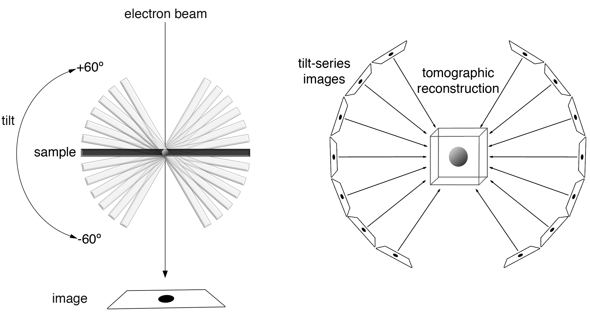

The "CZII - CryoET Object Identification" competition on Kaggle challenges participants to identify small biological structures within large 3D volumes obtained through cryo-electron tomography (Cryo-ET). This report shows the solution implemented with a 3D-Unet and 2D object detection model for multi-class segmentation, the results obtained show that both approaches achieve accuracy in more than 50\

# Introduction

The CryoET Object Identification challenge is funded by the
Chan Zuckerberg Initiative and its primary objective is to acquire more knowledge about protein complexes for cellular function, which are essential for disease treatments. The available data obtained from tomographs are often available in a standardized format, and the analysis of this specific information is challenging when identifying the types of protein complexes within these images. 

Cryo-electron tomography opens the door to the study of the structure of unique objects, such as cell structures and even entire cells \cite{stewart2017cryo}. To do this, multiple images of the sample are taken at different inclinations within the microscope (generally from -70º to 70º), which are subsequently processed using specialized programs to reconstruct its three-dimensional structure, as seen in the figure. The available dataset provided in the competition contains already classified and denoised images of tomographs, the classification includes six particle types with varying prediction difficulty: apo-ferritin (easy), beta-amylase (not scored, impossible), beta-galactosidase (hard), ribosome (easy), thyroglobulin (hard), and virus-like-particle (easy), with beta-amylase excluded from scoring due to its evaluation challenges.

# Methodology

## Dataset

The dataset consists of 7 cryo-electron tomography (cryoET) images, represented as 3D tomograms where each voxel corresponds to a 10x10x10 nm cube, as seen in the Figure. Each tomogram contains various objects of interest, whose locations are provided as centroid coordinates in associated files. Objects include ribosomes, virus-like particles, apo-ferritin, thyroglobulin, and B-galactosidase, with radius ranging from 6 to 15 voxels. The challenge allows a voxel-level labeling to be considered correct if it falls within half the particle's radius from the actual centroid. There are associated files to each tomogram containing x, y, z coordinates of object centroids.

Synthetic data has been used to train models to detect these objects. This data is generated with realistic characteristics mimicking the tomograms, serving as a proxy for real-world samples, especially when annotated real tomograms are limited.

For the second architecture implemented, the preparation of the datasets for training converts 3D volumetric data into 2D images slices, this reduces memory requirements and address data scarcity. Key steps  in this process include normalizing the data, creating image slices, generating YOLO-compatible annotations, and organizing datasets into structured folders for training and validation.

## Architectures Implemented

There are numerous architectures, methods and approaches that have proven to be especially effective in certain object detection tasks and for extracting features of tomograms. Among these, the YOLO (You Only Look Once) network \cite{diwan2023object} and 3D U-NET \cite{agrawal2022segmentation} stand out.

### 3D U-NET

3D U-Net is a convolutional neural network (CNN) architecture designed specifically for image segmentation tasks, where the goal is to classify each pixel (or voxel in 3D cases) in the input image. It is particularly well-suited for biomedical image analysis, making it ideal for the cryo-electron tomography (cryoET) dataset.\\
Key features of the model 3D U-Net are:

* Encoder-Decoder Structure:

  * Encoder: responsible for capturing contextual information by downsampling the input image through convolutional, max-pooling layers and extracting high-level features.
  * Decoder: responsible for reconstructing the spatial details by upsampling the features back to the input resolution and producing a dense segmentation map.

* Skip Connections: while encoding, the model also send the outputs to the corresponding layers and the Decoder help recover fine-grained spatial details lost during downsampling. These connections concatenate feature maps from the Encoder with those in the Decoder, enhancing localization accuracy.
* 3D Adaptation: For the CryoET dataset, the 2D U-Net is extended to a 3D version, where 3D convolutions and pooling operations are applied, enabling the model to process volumetric data and segment objects in 3D space effectively.

### YOLO

This method incorporates a real-time object detection stage, which uses a convolutional neural network to divide a 2D image into regions and predict the coordinates and probabilities of existence of the objects in each region. YOLO has the advantage of being fast, accurate and robust against different lighting conditions, size and shape of the objects.

Several studies have applied YOLO in detection tasks from medical images: such as mammography  [Al-Masni et al., 2018](https://www.nature.com/articles/s41592-018-0259-9), the study of melanoma [Nie et al., 2019](https://ieeexplore.ieee.org/document/8970033) and dental diseases [Sonavane & Kohar, 2022](https://link.springer.com/chapter/10.1007/978-981-16-6285-0_12), achieving accuracies and sensitivities above 90% in laboratory simulations and studies with patients, for internal validation data. These results may be an indicator of the effectiveness of the method in detecting abnormal objects in biomedical tasks, as well as its potential to become a novel approach, capable of performing disease detection and classification with good performance in clinical routine, which could also have relevant implications for this specific competition.

The Python programming language and PyTorch machine learning frameworks were used. Additionally, tools and libraries such as YOLOv5 from Ultralytics were employed to facilitate model training and object detection. The YOLO architecture was implemented using a pre-trained model (YOLO11), which incorporates recent advancements in object detection and data augmentation. Data pre-processing and augmentation included techniques like rotation, shear, flipping, and mix-up during training. The development and training process used a machine equipped with an NVIDIA L4 GPU (22.5 GB GDDR6), providing the computational power necessary to efficiently train the model + 235 GB HDD storage.

The latest YOLO11 model architecture, as shown in Appendix \ref{app3}, is composed by three main parts:

* Backbone: Is the deep learning architecture that acts as a feature extractor.
* Neck: Combines the features acquired from the various layers of the backbone model.
* Head: Predicts the classes and bounding box regions which is the final output produced by the object detection model. 

## Training Process

### Transfer Learning with Synthetic Data

Before training the model with real-world data, we opted for a transfer learning approach by pre-training the model on synthetic data. Synthetic data often provides a controlled environment where particle features, distributions, and annotations are more reliable and consistent than in real data. Pre-training allows the model to learn general features and patterns that are transferable to real-world data, such as recognizing particle shapes and boundaries.

### Pre-trained 3D U-NET

During training, the validation metric used in this model is Dice Metric, which is commonly used in segmentation tasks to evaluate the overlap between the predicted segmentation and the ground truth. It is not the same as "accuracy" in a traditional classification sense but is instead a measure of how well the predicted and true segmentation align.

The Dice score ranges from 0 to 1:

* 1 indicates perfect overlap (the prediction is exactly the same as the ground truth).
* 0 indicates no overlap.

It is computed as: 

$$
Dice~Score = \frac{2|A \cap B|}{|A| + |B|}
$$

Where:

* A is the predicted segmentation
* B is the ground truth segmentation.

The model performs well while training with the validation score increasing.\\  And as for the loss function used in 3D U-Net model is the Tversky Loss, which is particularly suited for imbalanced segmentation tasks, especially when one class significantly dominates the others.

The Tversky Loss is a generalization of the Dice Loss and is defined as:

$$
\mathcal{L}_{\text{Tversky}} = 1 - \frac{TP}{TP + \alpha \cdot FP + \beta \cdot FN}
$$

Where:
- \( TP \) = True Positives
- \( FP \) = False Positives
- \( FN \) = False Negatives
- \( $\alpha, $\beta \) are weights controlling the penalty for FP and FN respectively.

In this equation if $\alpha = $\beta = 0.5, this loss is equivalent to the Dice Loss.

The model's loss initially decreases well at first but then struggles to improves from around epoch 50.

### YOLO 

The training configuration includes the following parameters and optimization techniques: 

* Epochs: The model is trained for 100 full passes through the dataset.
* Warm-up Epochs: Gradual increase in the learning rate over the first 10 epochs.
* Batch Size: The number of samples processed in one training step is 32.
* Image Size: Input images are resized to 640 x 640 pixels.
* Data Augmentation: 
  * Rotation: Up to ±45 degrees.
  * Shear: Up to 5 degrees.
  * Horizontal and Vertical Flipping: Probabilities of 0.5 for both.
  * Mixup: A data augmentation technique that blends two training images.
  * Copy-Paste: Augmentation by combining regions from different images.
* Optimizer: AdamW
* Seed: 8620 – Used for reproducibility.
* Initial Learning Rate: 0.0003
* 

